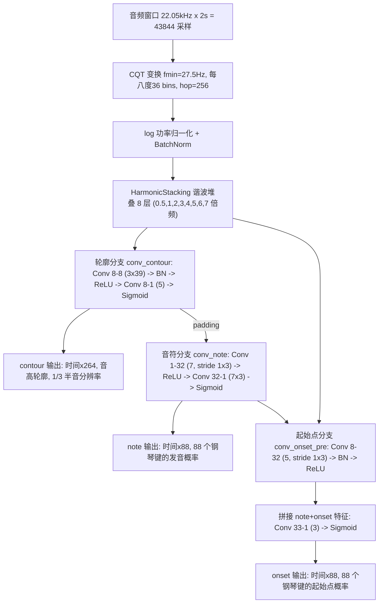

# 人声/吉他分离 + 扒谱 —— FPGA 实时方案

输入一段"人声 + 吉他"音频，在 FPGA 上分离出人声/伴奏两轨，并分别转写成 MIDI 谱。
**全流程不依赖 PC**，目标平台：安路 PH1A180-MLK-H10-CK203/204（TangDynasty 工具链）。

## 系统总览

```
音频输入 → [Spleeter U-Net 分离] → [Basic Pitch 转谱] → [软核后处理] → MIDI
           19.6M 参数 0.34 GMAC/s   16,782 参数 CNN       RISC-V 软核
           延迟约 3 秒（分块推理）    0.5 秒块长             音符事件输出
```

| 环节 | 方案 | 关键指标 |
|------|------|---------|
| 分离 | **Spleeter 2stems U-Net**（预训练权重 + INT8 量化） | **19.6 M 参数 → 19.6 MB，必须外挂 DDR**；实时 **0.34 GMAC/s**（奇偶分解后）；**延迟约 3 秒** |
| 转谱 | Basic Pitch（INT8 量化） | **16,782 参数**；484M MAC / 2 秒窗口 |
| 后处理 | 软核 CPU 跑 C 代码（移植自 `note_creation.py`） | 或简化为阈值 + 峰值状态机 |

> 分离有两套方案：**Spleeter U-Net（默认）** 音质好但延迟约 3 秒；
> **DSP 谐波掩码（备选）** 零参数、延迟 <100 ms 但音质一般。
> 若比赛硬性要求毫秒级延迟，切到备选方案（`docs/FPGA_分离实现方案_DSP备选.md`）。

## 文件结构

```
release/
├── README.md                        # 本文档（FPGA 总览）
├── requirements.txt                 # 依赖列表（仅验证脚本需要）
├── docs/
│   ├── FPGA_分离实现方案.md          # ★ 分离主方案：Spleeter 逐层参数/MAC/缓存/延迟/实现要点
│   ├── FPGA_分离实现方案_DSP备选.md  #    分离备选：DSP 谐波掩码（零参数、<100ms）
│   ├── FPGA_转谱实现方案.md          # ★ 转谱：CQT/卷积逐层参数/量化/后处理接口
│   └── PC端管线说明.md               # PC 端实现与验证记录（开发/报告用，FPGA 部署不需要）
├── models/
│   ├── basic_pitch_heads.onnx       # ★ 卷积主干 ONNX（含全部参数，70.8KB）
│   ├── basic_pitch_full.onnx        # 完整模型 ONNX（含 CQT，供对照）
│   └── basic_pitch_pytorch_icassp_2022.pth  # PyTorch 权重（转 ONNX 用）
├── scripts/
│   ├── export_onnx.py               # 导出 ONNX + 逐层参数表 + 数值自检
│   ├── spleeter/                    # ★ 分离（Spleeter）参考实现，见该目录 README
│   │   ├── unet.py                  #   U-Net 定义（逐层对应分离文档 §2）
│   │   ├── run_spleeter.py          #   分离推理（支持 --patch 选择分块大小）
│   │   ├── download_weights.py      #   下载权重（hf-mirror），可 --onnx 直接导出 ONNX
│   │   ├── export_spleeter_onnx.py  #   导出 ONNX（给 RTL 做黄金参考）
│   │   ├── layer_stats.py           #   逐层参数/MAC 表（分离文档数据来源）
│   │   └── eval_patch.py            #   分块大小 vs 质量（延迟取舍，分离文档 §4）
│   ├── dsp_separate.py              # 备选分离方案 Python 参考实现
│   ├── tune_dsp.py                  # 备选：参数扫描（复现最优配置）
│   ├── eval_dsp.py                  # 备选：分离质量评分（SI-SDR）
│   ├── transcribe.py                # PC 参考：单轨转写（用于生成对比基准）
│   ├── separate_and_transcribe.py   # PC 用：Demucs 分离转谱（见 docs/PC端管线说明.md）
│   └── show_structure.py            # 打印网络结构与参数量
├── basic_pitch_torch/               # PyTorch 参考实现（逐层与 ONNX 对应）
├── audio/
│   └── 吉他+人声.mp3                 # 演示用真实录音（约 77 秒）
└── output/                          # 演示输出（Demucs 参考分离音轨 + MIDI）
```

## 模型结构

Basic Pitch 是一个"CQT + 谐波堆叠 + 三分支卷积"网络，总参数量 **16,782**：



三个输出分工：

- **note**（88 维）：每一帧"哪些音高正在发声"
- **onset**（88 维）：每一帧"哪些音高刚刚开始"
- **contour**（264 维）：每 1/3 半音级的精细音高，用于生成滑音/音高弯曲

前端细节：CQT 最低频率 27.5Hz（钢琴最低键），覆盖 88 个钢琴键；谐波堆叠把 0.5~7 倍频的
能量沿频率轴平移到基频带并堆叠，让低音也能利用其泛音能量，提升复音转写精度。

## 测试结果（模型数值验证）

**参考模型的数值可信度**（硬件团队做 RTL 验证的基准）：

| 对比 | 最大误差 |
|------|---------|
| PyTorch 复现 vs 官方 TensorFlow 原版 | < 3e-4 |
| ONNX 卷积主干 vs PyTorch | < 1e-6 |
| ONNX 完整模型 vs PyTorch | < 1e-5 |

即 `models/*.onnx` 可作为 RTL 实现的"标准答案"。

## FPGA 部署方案

面向**纯 FPGA、无 PC 参与**的场景（目标平台：安路 PH1A180-MLK-H10-CK203/204，
TangDynasty 工具链），本项目提供完整方案。
（PC 端管线的 Demucs 有 41M 参数 Transformer 注意力，无法手写 RTL，因此分离换成 Spleeter 2stems U-Net。）

### 为什么 Spleeter 能塞进 FPGA

1. **算力比想象中低**：单模型 6.10 GMAC / 512 帧块，但 stride=2 卷积做**奇偶分解**后只剩
   **1.54 GMAC**；双模型实时（含 25% 重叠）只需 **0.34 GMAC/s**，与转谱（0.24 GMAC/s）同量级。
2. **带宽不是问题**：19.6 MB 权重放 DDR，每次分块顺序读一遍，128 帧块时仅 ≈9 MB/s。
3. **片上缓存只要 ≈1 MB**（128 帧块）：5 条跳跃连接 254 KB + 解码器中间张量 ≈500 KB + 输入谱 262 KB。
4. **量化友好**：编码器 BN 可离线折叠进卷积，解码器 BN 化成逐通道 scale/shift，
   LeakyReLU 用移位（0.2≈51/256），Sigmoid/倒数用 LUT。
5. **只处理 11 kHz 以下**：模型只吃前 1024 个频点，高频旁路给伴奏，转谱（≤7.8 kHz）不受影响。

实测分离质量（vs Demucs 参考，SI-SDR）：**人声 12.98 dB / 伴奏 8.74 dB**，
比备选 DSP 方案（5.53 / 0.20 dB）高一个数量级。

### 限制在哪里（必须知道的边界）

| 限制 | 说明 |
|------|------|
| **延迟约 3 秒** | Spleeter 是非流式整块推理，片内要攒够 128 帧（2.97 s）才出结果；若要毫秒级延迟则需改用备选 DSP 方案 |
| **必须外挂 DDR** | 19.6 MB 权重远超片内 BSRAM；无 DDR 的板子不可行 |
| **11 kHz 以上不入模型** | 人声齿音缺失、高频全归伴奏，人声听感略闷（对转谱无影响） |
| **全局归一化需流式近似** | PC 版按整首歌算 mu/sd，FPGA 改用滑动统计（需实测回归） |
| **INT8 掉点待验证** | 预期 0.5~1.5 dB，上板前需用 onnxruntime 量化后回归一次 |
| **转谱有量化误差** | INT8 后音符判定阈值需重新标定，可能轻微漏音/增音 |
| **CQT 是资源风险点** | 顶八度 36 个复数核频谱 ROM 约 288KB，可能超出片内 BRAM → 需外扩存储或用近似方案（需实测验证精度） |
| **后处理需要软核** | 峰值检测/音符跟踪不适合纯 RTL，会占用 MCU 资源与开发时间 |
| **输出范围有限** | 只输出 MIDI/音符事件（不输出分离音频）；只覆盖钢琴 88 键音域，超范围音高（低音贝斯、打击乐）不输出 |

详细实现文档：

- [`docs/FPGA_分离实现方案.md`](docs/FPGA_分离实现方案.md)——**主方案（Spleeter）**：总体数据流、逐层张量/参数/MAC 表、算力与缓存分析、延迟取舍实测、FPGA 实现要点（奇偶分解/转置卷积/定点化/DDR 调度）
- [`docs/FPGA_分离实现方案_DSP备选.md`](docs/FPGA_分离实现方案_DSP备选.md)——**备选方案（DSP 谐波掩码）**：零参数、延迟 <100 ms，适合对延迟敏感的场景
- [`docs/FPGA_转谱实现方案.md`](docs/FPGA_转谱实现方案.md)——CQT 多速率实现、逐层卷积参数表、量化方案、后处理接口

ONNX 算子图（供硬件团队做 RTL 参考与量化仿真）：

- `models/basic_pitch_heads.onnx`——**转谱主干**（含全部参数，输入 `(1,8,T,264)`），与 PyTorch 数值误差 < 1e-6
- `models/basic_pitch_full.onnx`——完整模型（含 CQT，供对照）
- `scripts/spleeter/onnx/spleeter_{vocals,accompaniment}.onnx`——**分离模型**（各 37.5 MB，不入库）

重新导出与自检：

```powershell
python scripts/export_onnx.py --out-dir models                       # 转谱 ONNX
python scripts/spleeter/download_weights.py --onnx                    # 分离权重 + ONNX（约 75 MB）
```

> 分离质量（vs Demucs 参考，见 `docs/PC端管线说明.md` 与 `scripts/spleeter/README.md`）：
> 人声保留 **0.976**、吉他泄漏进人声 **0.099**、人声泄漏进伴奏 **0.042**、
> 人声 SI-SDR **12.98 dB**、伴奏 SI-SDR **8.74 dB**（128 帧分块时 12.60 / 8.44 dB，仅掉 0.4 dB）。
> 相比原零参数 DSP 方案（0.884 / 0.209 / 0.276，5.53 / 0.20 dB）是数量级提升，
> 代价是延迟从 <100 ms 变成约 3 秒。

## 快速验证（可选，先在 PC 上跑一次）

建议硬件团队先在 PC 上跑一遍，确认手里的 ONNX 与参考实现一致，作为后续 RTL 验证的基准：

```powershell
pip install -r requirements.txt

# --- 转谱（Basic Pitch）---
python scripts/export_onnx.py --out-dir models                       # 导出 ONNX + 逐层参数表 + 数值自检

# --- 分离（Spleeter）---
python scripts/spleeter/download_weights.py --onnx                    # 下载权重 + 导出 ONNX
python scripts/spleeter/layer_stats.py                                # 逐层参数量 / MAC 表（文档 §2.1 §3.1）
python scripts/spleeter/run_spleeter.py --audio "audio\吉他+人声.mp3" --patch 128 --out-dir out_p128
python scripts/spleeter/eval_patch.py --ref-dir output                # 分块大小 vs 质量（文档 §4）
```

> 以上依赖仅用于验证脚本，FPGA 部署本身不需要 Python。
> 分离模型的 ONNX（两个 37.5 MB 文件）未入库，用上面的 `--onnx` 一条命令重新生成即可。

## 参考

- [Spotify Basic Pitch（原版）](https://github.com/spotify/basic-pitch)
- Bittner, R. M., et al. "A lightweight instrument-agnostic model for polyphonic note
  transcription and multipitch estimation." ICASSP 2022.
