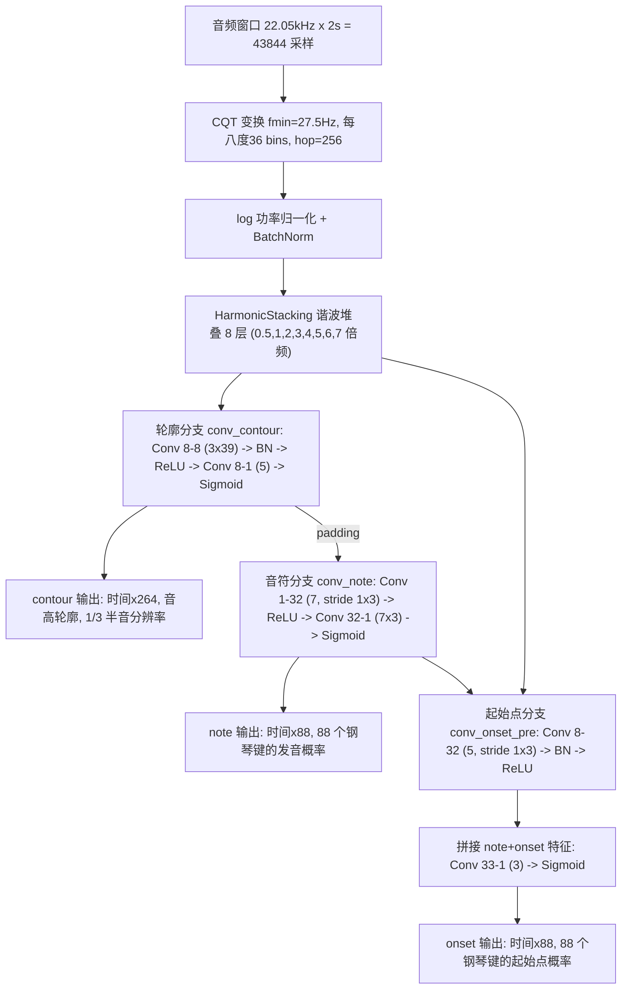

# Basic Pitch —— FPGA 实时"人声/吉他分离 + 扒谱"方案

输入一段"人声 + 吉他"音频，在 FPGA 上实时分离出人声/伴奏两轨，并分别转写成 MIDI 谱。
**全流程不依赖 PC**，目标平台：安路 PH1A180-MLK-H10-CK203/204（TangDynasty 工具链）。

## 系统总览

```
音频输入 → [DSP 谐波掩码分离] → [Basic Pitch 转谱] → [软核后处理] → MIDI
           零参数、纯 FFT          16,782 参数 CNN        RISC-V 软核
           延迟 < 100ms            0.5 秒块长            音符事件输出
```

| 环节 | 方案 | 关键指标 |
|------|------|---------|
| 分离 | DSP 谐波掩码（FFT → 谐波筛法估 F0 → 掩码 → IFFT） | **零参数**；帧延迟 23ms；查找表 ROM 约 2.7KB |
| 转谱 | Basic Pitch（INT8 量化） | **16,782 参数**；484M MAC / 2 秒窗口 |
| 后处理 | 软核 CPU 跑 C 代码（移植自 `note_creation.py`） | 或简化为阈值 + 峰值状态机 |

## 文件结构

```
release/
├── README.md                        # 本文档（FPGA 总览）
├── requirements.txt                 # 依赖列表（仅验证脚本需要）
├── docs/
│   ├── FPGA_分离实现方案.md          # ★ 分离：逐帧数据流/查找表/资源/延迟/参数速查表
│   ├── FPGA_转谱实现方案.md          # ★ 转谱：CQT/卷积逐层参数/量化/后处理接口
│   └── PC端管线说明.md               # PC 端实现与验证记录（开发/报告用，FPGA 部署不需要）
├── models/
│   ├── basic_pitch_heads.onnx       # ★ 卷积主干 ONNX（含全部参数，70.8KB）
│   ├── basic_pitch_full.onnx        # 完整模型 ONNX（含 CQT，供对照）
│   └── basic_pitch_pytorch_icassp_2022.pth  # PyTorch 权重（转 ONNX 用）
├── scripts/
│   ├── export_onnx.py               # 导出 ONNX + 逐层参数表 + 数值自检
│   ├── dsp_separate.py              # ★ 分离算法 Python 参考实现（与文档逐步对应）
│   ├── tune_dsp.py                  # 分离参数扫描（复现最优配置）
│   ├── eval_dsp.py                  # 分离质量评分（SI-SDR）
│   ├── transcribe.py                # PC 参考：单轨转写（用于生成对比基准）
│   ├── separate_and_transcribe.py   # PC 用：Demucs 分离转谱（见 docs/PC端管线说明.md）
│   └── show_structure.py            # 打印网络结构与参数量
├── basic_pitch_torch/               # PyTorch 参考实现（逐层与 ONNX 对应）
├── audio/
│   └── 吉他+人声.mp3                 # 演示用真实录音（约 77 秒）
└── output/                          # 演示输出（分离音轨 + MIDI）
```

## 模型结构

Basic Pitch 是一个"CQT + 谐波堆叠 + 三分支卷积"网络，总参数量 **16,782**：



三个输出分工：

- **note**（88 维）：每一帧"哪些音高正在发声"
- **onset**（88 维）：每一帧"哪些音高刚刚开始"
- **contour**（264 维）：每 1/3 半音级的精细音高，用于生成滑音/音高弯曲

前端细节：CQT 最低频率 27.5Hz（钢琴最低键），覆盖 88 个钢琴键；谐波堆叠把 0.5~7 倍频的
能量沿频率轴平移到基频带并堆叠，让低音也能利用其泛音能量，提升复音转写精度。

## 测试结果（模型数值验证）

**参考模型的数值可信度**（硬件团队做 RTL 验证的基准）：

| 对比 | 最大误差 |
|------|---------|
| PyTorch 复现 vs 官方 TensorFlow 原版 | < 3e-4 |
| ONNX 卷积主干 vs PyTorch | < 1e-6 |
| ONNX 完整模型 vs PyTorch | < 1e-5 |

即 `models/*.onnx` 可作为 RTL 实现的"标准答案"。

## FPGA 实时部署方案

面向**纯 FPGA、流式实时、无 PC 参与**的场景（目标平台：安路 PH1A180-MLK-H10-CK203/204，
TangDynasty 工具链），本项目提供完整方案。
（PC 端管线的 Demucs 有 41M 参数，无法上 FPGA，因此分离改用**零参数 DSP 算法**。）

```
音频输入 → [DSP 谐波掩码分离] → [Basic Pitch 转谱] → [软核后处理] → MIDI
           零参数、纯 FFT          16,782 参数 CNN        RISC-V 软核
           延迟 < 100ms            0.5 秒块长
```

| 环节 | 方案 | 关键指标 |
|------|------|---------|
| 分离 | DSP 谐波掩码（FFT → 谐波筛法估 F0 → 掩码 → IFFT） | **零参数**；帧延迟 23ms；查找表 ROM 约 2.7KB |
| 转谱 | Basic Pitch（INT8 量化） | **16,782 参数**；484M MAC / 2 秒窗口 |
| 后处理 | 软核 CPU 跑 C 代码（移植自 `note_creation.py`） | 或简化为阈值 + 峰值状态机 |

### 为什么现在能塞进 FPGA

1. **分离从 41M 参数降到 0**：Demucs 不可行的根因是 Transformer 注意力 + 80MB 权重；
   换成 DSP 谐波掩码后**没有任何权重**，每帧只做 FFT + 672 次查表累加。
2. **转谱只有 16,782 个参数**：INT8 后权重约 17KB，计算量 484M MAC / 2 秒窗口（≈242M MAC/s），
   与分离模块同一量级，PH1A180 的 DSP/BRAM 完全够用。
3. **全流式结构**：分离逐帧（23ms）流水；转谱是全卷积、对时间长度不敏感，可按 0.5 秒块滑动，
   CNN 用行缓冲只需几 KB BRAM，**不需要存整张 (8,172,264) 特征图**。
4. **量化友好**：BatchNorm 可离线折叠进卷积（零运行时开销）、Sigmoid 用 LUT、谐波堆叠是纯地址偏移。

### 限制在哪里（必须知道的边界）

| 限制 | 说明 |
|------|------|
| **分离质量有物理上限** | 人声与吉他频率重叠处无法区分；实测人声轨 SI-SDR 3.57 dB（Demucs 参考值 4.55 dB），伴奏轨听感偏"挖空" |
| **只支持单声部人声** | 谐波掩码假设"单一基频"，合唱、和声、多人说话会失效 |
| **转谱有量化误差** | INT8 后音符判定阈值需重新标定，可能轻微漏音/增音 |
| **延迟不是"瞬时"** | 分离 <100ms + 转谱 0.5s 块 → 总延迟约 **0.6~1.1 秒**（要更低需缩短块长并接受精度下降） |
| **CQT 是资源风险点** | 顶八度 36 个复数核频谱 ROM 约 288KB，可能超出片内 BRAM → 需外扩存储或用近似方案（需实测验证精度） |
| **后处理需要软核** | 峰值检测/音符跟踪不适合纯 RTL，会占用 MCU 资源与开发时间 |
| **输出范围有限** | 只输出 MIDI/音符事件（不输出分离音频）；只覆盖钢琴 88 键音域，超范围音高（低音贝斯、打击乐）不输出 |

详细实现文档：

- [`docs/FPGA_分离实现方案.md`](docs/FPGA_分离实现方案.md)——逐帧数据流、查找表设计、资源与延迟估算、参数速查表
- [`docs/FPGA_转谱实现方案.md`](docs/FPGA_转谱实现方案.md)——CQT 多速率实现、逐层卷积参数表、量化方案、后处理接口

ONNX 算子图（供硬件团队做 RTL 参考与量化仿真）：

- `models/basic_pitch_heads.onnx`——**卷积主干**（含全部参数，输入 `(1,8,T,264)`），与 PyTorch 数值误差 < 1e-6
- `models/basic_pitch_full.onnx`——完整模型（含 CQT，供对照）

重新导出与自检：

```powershell
python scripts/export_onnx.py --out-dir models
```

> 分离质量客观评分（以 Demucs 为参考的 SI-SDR）：人声轨 **3.57 dB**、伴奏轨 -0.71 dB。
> 零参数 DSP 分离存在物理上限（人声与吉他频率重叠处不可分），预期听感为"人声保留主旋律谐波、
> 伴奏偏挖空"，请以"可实时、零参数、可用"为目标评估。

## 快速验证（可选，先在 PC 上跑一次）

建议硬件团队先用 Python 跑一遍，确认手里的 ONNX 与参考实现一致，作为后续 RTL 验证的基准：

```powershell
pip install -r requirements.txt
python scripts/export_onnx.py --out-dir models    # 导出 ONNX + 逐层参数表 + 数值自检
python scripts/dsp_separate.py --audio 音频.wav --out-dir 输出目录   # 分离算法参考实现
```

> 以上依赖仅用于验证脚本，FPGA 部署本身不需要 Python。

## 参考

- [Spotify Basic Pitch（原版）](https://github.com/spotify/basic-pitch)
- Bittner, R. M., et al. "A lightweight instrument-agnostic model for polyphonic note
  transcription and multipitch estimation." ICASSP 2022.
