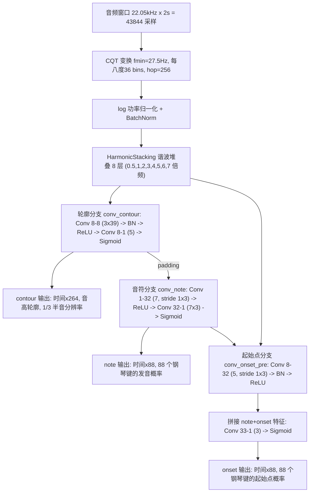

# Basic Pitch (PyTorch) + 人声/吉他分离扒谱

本项目包含两部分：

1. **Basic Pitch 的 PyTorch 复现**——Spotify 的轻量级音频转 MIDI 模型，预训练权重来自官方
   （TensorFlow 版转换而来），可直接用于任意音频的复音转谱。
2. **人声+吉他同步扒谱管线**——先用 Demucs 把混音分离成人声轨和伴奏轨，再对每条轨分别跑
   Basic Pitch 转写，一次得到**人声谱 + 吉他谱**两份 MIDI。

## 文件结构

```
release/
├── README.md                        # 本文档
├── requirements.txt                 # 依赖列表
├── basic_pitch_torch/               # 模型与推理代码
│   ├── model.py                     # 神经网络定义（BasicPitchTorch）
│   ├── inference.py                 # 推理流程（分窗、拼接、predict 入口）
│   ├── note_creation.py             # 模型输出 → MIDI 后处理
│   └── constants.py                 # 常量（采样率、频率 bin 等）
├── models/
│   └── basic_pitch_pytorch_icassp_2022.pth   # 预训练权重（ICASSP 2022）
├── scripts/
│   ├── transcribe.py                # 单轨转写：音频 → MIDI
│   ├── separate_and_transcribe.py   # 两阶段：混音 → 人声 MIDI + 吉他 MIDI
│   └── show_structure.py            # 打印网络结构与参数量
├── audio/
│   └── 吉他+人声.mp3                 # 演示用真实录音（约 77 秒）
└── output/                          # 演示输出
    ├── vocals.wav                   # 分离出的人声轨
    ├── accompaniment.wav            # 分离出的伴奏轨（吉他）
    ├── 吉他+人声_vocals.mid          # 人声谱
    └── 吉他+人声_guitar.mid          # 吉他谱
```

## 快速开始

### 1. 安装依赖

```powershell
pip install -r requirements.txt
```

（需要 Python 3.8+，建议使用带 CUDA 的 PyTorch 以获得 GPU 加速；CPU 也能跑。）

### 2. 单轨转写（输入音频 → 输出 MIDI）

```powershell
python scripts/transcribe.py --audio 你的音频.wav
# 输出：你的音频.mid
```

适用于任意单乐器/多乐器音频：钢琴、吉他、人声、管乐……输出包含所有音符、力度和
音高弯曲（滑音）的 MIDI 文件，可直接导入 MuseScore、Cubase、Logic 等查看乐谱。

### 3. 人声+吉他同步扒谱（输入混音 → 输出两份分轨谱）

```powershell
python scripts/separate_and_transcribe.py --audio 你的混音.mp3 --out-dir 输出目录
```

输出 4 个文件：

| 文件 | 内容 |
|------|------|
| `vocals.wav` | 分离出的人声轨 |
| `accompaniment.wav` | 分离出的伴奏轨（吉他等） |
| `<音频名>_vocals.mid` | 人声谱 |
| `<音频名>_guitar.mid` | 吉他/伴奏谱 |

> 提示：首次运行会自动下载 Demucs 权重（约 80MB，只需一次）。

## 输入 → 输出

| 模式 | 输入 | 输出 |
|------|------|------|
| 单轨转写 | 任意音频文件（wav/mp3/flac，自动重采样到 22.05kHz 单声道） | 1 个 MIDI（全部音符） |
| 分离转谱 | 人声+吉他（或带伴奏）混音 | 2 个分离音轨 wav + 2 个 MIDI |

## 模型结构

Basic Pitch 是一个"CQT + 谐波堆叠 + 三分支卷积"网络，总参数量 **16,782**：



三个输出分工：

- **note**（88 维）：每一帧"哪些音高正在发声"
- **onset**（88 维）：每一帧"哪些音高刚刚开始"
- **contour**（264 维）：每 1/3 半音级的精细音高，用于生成滑音/音高弯曲

前端细节：CQT 最低频率 27.5Hz（钢琴最低键），覆盖 88 个钢琴键；谐波堆叠把 0.5~7 倍频的
能量沿频率轴平移到基频带并堆叠，让低音也能利用其泛音能量，提升复音转写精度。

## 测试结果

### 验证 1：与原版 TensorFlow 模型输出对比

用官方测试音频（GuitarSet）对比 PyTorch 复现与 Spotify TensorFlow 原版：

| 输出 | 最大绝对误差 | 平均绝对误差 |
|------|-------------|-------------|
| contour | 0.000301 | 5.86e-06 |
| onset | 0.000271 | 1.43e-05 |
| note | 0.000230 | 6.60e-06 |

转写出的 MIDI 与原版**完全一致**（95 个音符逐项相同）。

### 验证 2：真实"吉他+人声"录音端到端测试

对 `audio/吉他+人声.mp3`（77 秒）运行分离转谱管线，分离耗时约 5 秒（GPU）：

| 输出 | 音符数 | 音高范围 | 说明 |
|------|--------|----------|------|
| 人声谱 `吉他+人声_vocals.mid` | 169 | 54~70 为主 | 集中在中音区，符合演唱音域 |
| 吉他谱 `吉他+人声_guitar.mid` | 429 | 42~54 密集 | 低频密集，符合分解和弦伴奏形态 |

分离出的 `vocals.wav` 与 `accompaniment.wav` 可直接试听核对分离质量。

## 原理简述

- **Basic Pitch**（Bittner et al., ICASSP 2022）是一个乐器无关的复音转录模型：把音频做成
  对数频率的时频图（CQT），用全卷积网络同时预测音符、起始点和音高轮廓三张热力图，
  再经后处理转成 MIDI。它只回答"什么时间有什么音高"，不区分乐器。
- **分离转谱管线**：Demucs（Hybrid Transformer Demucs）先把混音按声源分离
  （人声/鼓/贝斯/其他），再对每条声源轨单独转写。因为转写是逐轨进行的，天然得到
  每个乐器独立的谱子。

## 已知限制

- Basic Pitch 对超出钢琴 88 键范围的音高（如极低贝斯、打击乐）不输出音符。
- Demucs 分离不是 100% 干净，两条轨之间可能有少量串音（如人声谱里偶见极低音）。
- MIDI 输出默认速度 120 BPM，节拍需要在 DAW 中自行对齐。
- 首次运行需要联网下载 Demucs 权重（约 80MB）。

## 参考

- [Spotify Basic Pitch（原版）](https://github.com/spotify/basic-pitch)
- [Demucs](https://github.com/facebookresearch/demucs)
- Bittner, R. M., et al. "A lightweight instrument-agnostic model for polyphonic note
  transcription and multipitch estimation." ICASSP 2022.
