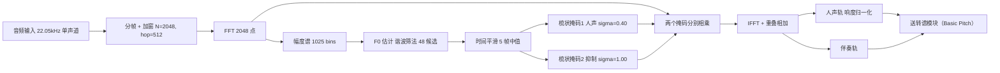

# 人声/吉他分离 —— FPGA 实现方案（DSP 谐波掩码法）

> 目标平台：安路 PH1A180-MLK-H10-CK203/204（TangDynasty 工具链）
> 约束：**分离环节必须在 FPGA 上、严格流式实时（延迟 <100ms）**、无 PC 参与
> 方案特点：**零神经网络参数**，纯 FFT + 查表 + 乘加，全部算法已验证（Python 原型 + 客观评分）

## 1. 总体数据流

**核心思想**：人声是单音高旋律，吉他是复音伴奏。逐帧估计人声基频 F0，
在 F0 谐波位置用**平滑梳状掩码**提取人声；伴奏则用**更宽的梳状掩码**把"人声谐波及其裙边"挖掉。

**关键设计（v2 改进）**：

1. 硬掩码(0/1) → **平滑梳状掩码**（按半音距离高斯衰减），保留人声共振峰裙边，声音更饱满；
2. 单一掩码 → **不对称掩码**：人声轨用窄梳状（σ=0.40 半音），伴奏轨用宽抑制（σ=1.00），
   两轨之和不等于原混音，但互相泄漏显著下降；
3. 输出加**响度归一化**（人声轨对齐到 -1.5 dB 相对输入 RMS，带峰值保护）。

## 2. 逐帧算法（FPGA 数据流）

| 步骤 | 运算 | 参数 |
|------|------|------|
| 1. 分帧 | 移位寄存器 | 窗长 2048 采样（93ms），hop 512 采样（**23.2ms**），Hann 窗 |
| 2. FFT | 1 个 2048 点复数 FFT | 帧率 22050/512 ≈ **43.1 帧/秒** |
| 3. 幅度谱 | 实部虚部求模（近似：abs+0.4·min） | 1025 个频点 |
| 4. F0 估计 | 48 个候选频率，各累加 20 次谐波的 bin 幅度，取最大 | 候选 80~500Hz 对数网格 |
| 5. 置信度 | 最大分数 / 帧平均幅度，阈值 **0.15** 判"有声" | |
| 6. 时间平滑 | 5 帧中值滤波（移位寄存器） | 抑制逐帧跳变 |
| 7. 掩码生成 | 查 ROM：高斯梳状权重（两套 σ） | 见第 4 节 |
| 8. 掩码相乘 | 人声 = X·M(σ=0.40)；伴奏 = X·(1−M(σ=1.00)) | 1025 点 × 2 |
| 9. IFFT + 重叠相加 | 2 路 IFFT（可复用 1 个核） | 输出两路时域流 |
| 10. 响度归一化 | 人声轨乘增益，对齐目标 RMS | 慢速 RMS 统计 |

### F0 估计细节（谐波筛法）

- 候选网格：`80Hz × (500/80)^(i/47)`，i=0..47，**48 个候选**（6 bit 编码）
- 每个候选取 k=1..20 次谐波，且 `k·F0 ≤ 4500Hz`
- 分数 = 谐波位置幅度之和 / 谐波个数；取分数最大的候选作为该帧 F0
- 复杂度：48 × 20 ≈ **960 次查表 + 累加/帧**，43 帧/秒 → 约 4 万次乘加/秒，**对 FPGA 可忽略**

## 3. 延迟与资源估算

| 项 | 数值 | 说明 |
|----|------|------|
| 帧延迟 | 23.2ms | 1 个 hop |
| 端到端延迟 | **约 50~70ms** | 窗填充 + FFT 流水 + 处理，满足 <100ms |
| FFT 需求 | 3 个 2048 点 FFT/帧（1 正 + 2 逆） | 可复用 1 个核分时完成 |
| 主频需求 | 100MHz 下每帧有 2.3M 时钟周期可用，极其宽裕 | |
| ROM | 谐波 bin 表 48×20×2 ≈ **3.8KB**；高斯权重 LUT ≈ **128B** | 可用 BRAM |
| RAM | 谱缓冲 + 重叠相加缓冲 + 响度统计：约 **8~12KB** | 可用 BRAM |

## 4. FPGA 实现要点

1. **查找表预计算**：每个候选的 20 个谐波中心/边界 bin 与高斯权重全部离线算好放进 ROM：
   - ROM 表 1：`bin[48][20]`（谐波中心 bin，11bit）≈ 1.3KB
   - ROM 表 2：`lo/hi[48][20]`（梳状边界，11bit）≈ 2.6KB
   - ROM 表 3：**高斯权重 LUT**（按半音距离量化为 8 级，3bit）≈ 128B
2. **掩码生成**：取候选编号 → 读中心 bin → 在 ±3σ 范围内按距离查权重表 → 写掩码 RAM。
   两套掩码（σ=0.40 / σ=1.00）共用同一张表，只是查询范围不同（窄/宽）。
3. **定点化**：幅度谱 16bit 无符号；累加 20bit 防溢出；掩码 8bit（0~255）。
   FFT 内部按安路 FFT IP 默认定点格式即可。
4. **置信度除法**：移位近似（除以 2 的幂）或预计算倒数表，避免实时除法器。
5. **中值滤波**：5 级移位寄存器 + 3 输入中值比较器。
6. **响度归一化**：慢速 RMS 累加器（1~2 秒窗）+ 移位除法；
   若资源紧张可改为**离线标定的固定增益**（换录音需重标）。
7. **两路 IFFT**：可复用同一个 IFFT 核，分时处理人声/伴奏（帧内时间足够）。
8. **简化版本**（若资源紧张）：去掉置信度归一化；或退化为单一互补掩码（泄漏会上升）。

## 5. 与转谱环节的接口

- 分离输出：**两路时域音频流**（22.05kHz, 16bit），分别送入转谱模块
- 转谱用 **Basic Pitch（16,782 参数）**：INT8 量化后可上 FPGA，但需要：
  - CQT 前端（多分辨率 FFT，可复用分离模块的 FFT 核思路）
  - 小型 CNN 推理核（3 个卷积分支 + BatchNorm + Sigmoid）
  - 这部分建议单独出 RTL 方案（可另写文档）
- 也支持"仅分离"的演示模式：输出两路音频直接听

## 6. 实测质量（真实"吉他+人声"录音，77.8 秒）

以下为与 Demucs 参考分离结果的相关性（保留越高越好，泄漏越低越好）：

| 指标 | 初版（硬掩码） | **现行版本**（平滑梳状 + 不对称掩码） |
|------|--------------|-----------------------------------|
| 人声保留 | 0.833 | **0.884** |
| 吉他泄漏进人声 | 0.226 | **0.209** |
| 人声泄漏进伴奏 | 0.459 | **0.276**（强抑制档 0.220） |
| 吉他保留（伴奏轨） | 0.678 | **0.715**（强抑制档 0.675） |
| 人声轨电平 | -3.3 dB | **-1.5 dB**（响度已修复） |

补充 SI-SDR（`scripts/eval_dsp.py` 输出）：人声轨 **5.53 dB**（初版 3.57 dB）、
伴奏轨 **0.20 dB**（初版 -0.71 dB）。

**天花板分析（重要，给报告用）**：用 Demucs 的干净人声提取"标准答案 F0"后跑**同一套掩码**，
人声泄漏可低至 **0.096**、主歌弱段泄漏 0.209 —— 说明**掩码本身还有一倍空间，瓶颈在 F0 估计**。
实测 F0 误差结构：准确(<1 半音) 44.7%、八度错误 13.7%、**随机错误 41.6%（被吉他抢走）**。
最后一项需要"音色辨识能力"（学习模型）才能解决，**纯 DSP 启发式已接近上限**。

已尝试但**无效**的方向（避免重复踩坑）：Viterbi 音高连续性跟踪（±0.01）、
迭代自优化（自强化不纠错）、REPET 时间中值背景（此素材伴奏非循环，反而更差）、
歌手音域约束（实际音域 ≈ 默认范围）。

**预期听感**：人声轨 = 主旋律完整、响度正常，但人声较弱的主歌段会有吉他泛音残留；
伴奏轨 = 人声谐波位置被挖掉，听感偏"中空"。

## 7. 参数速查表（可直接给 RTL 实现）

| 参数 | 值 |
|------|-----|
| 采样率 | 22050 Hz |
| FFT 点数 / hop | 2048 / 512（帧率 43.07 fps） |
| 窗函数 | Hann |
| F0 范围 / 候选数 | 80 ~ 500 Hz / 48（对数网格） |
| 谐波数 / 频率上限 | 20 次 / 4500 Hz |
| **人声掩码** σ / 上限 | **0.40 半音** / 4500 Hz |
| **伴奏抑制掩码** σ / 上限 | **1.00 半音**（温和档；1.5 = 强抑制）/ 6000 Hz |
| 高斯权重量化 | 8 级（3bit LUT） |
| 有声判决阈值 | 置信度 0.15 |
| 时间平滑窗 | 5 帧中值 |
| 响度归一化 | 人声轨 −1.5 dB（相对输入 RMS），峰值保护 0.99 |

## 8. 验证代码

- Python 原型：`scripts/dsp_separate.py`（与本方案逐步对应，可逐行对照）
- 参数扫描：
  - `scripts/tune_dsp.py`（初版参数扫描）
  - `scripts/tune_dsp2.py`（不对称掩码 σ 扫描，v2 最优配置来源）
  - `scripts/tune_dsp3.py`（Viterbi / 置信度加权对比实验）
- 客观评分：`scripts/eval_dsp.py`（SI-SDR）
- 用法：`python scripts/dsp_separate.py --audio 混音.wav --out-dir 输出目录`

## 9. 为什么能塞进 FPGA / 限制在哪

### 能塞进去的原因

1. **零参数**：没有任何权重需要存储和读取，省掉外部 DDR 与权重带宽；
2. **纯 FFT + 查表**：每帧仅 960 次查表累加 + 2050 点掩码乘法，43 帧/秒 → 计算量可忽略；
3. **天然流式**：逐帧处理，无需整曲缓冲，延迟与内存都是常数级；
4. **量化简单**：幅度谱 16bit、掩码 8bit，不涉及神经网络量化误差。

### 限制（红线）

| 限制 | 影响 | 应对 |
|------|------|------|
| **F0 估计是瓶颈** | 41.6% 的帧 F0 被吉他抢走 → 泄漏（人声泄漏 0.276） | 需音色辨识能力（学习模型），DSP 已接近上限 |
| **人声弱/音低时最差** | 主歌段吉他泄漏 0.417（副歌 0.234） | 场景上可接受；或后期加小模型 |
| **假设人声单声部** | 合唱、和声、双人说话会失效（只会锁定一个基频） | 场景限定为独唱 |
| **不对称掩码 ≠ 完美重建** | 两轨之和 ≠ 原混音（部分能量被丢弃） | 换取泄漏下降，属有意设计 |
| **固定音域参数** | F0 限制 80~500Hz，超出此范围的人声（低音歌手/假声）效果差 | 按实际歌手调整查找表 |
| **只做二分离** | 固定"人声 vs 其余"，无法进一步区分吉他/鼓/贝斯 | 若要多乐器需多路掩码或级联多级分离 |
| **不处理混响** | 掩码法不分离混响尾巴，人声轨会残留少量混响 | 属算法固有特性，对转谱影响可控 |
