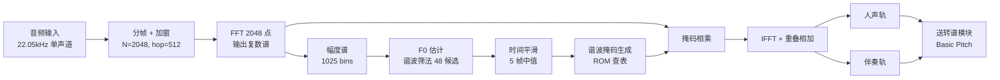

# 人声/吉他分离 —— FPGA 实现方案（DSP 谐波掩码法）

> 目标平台：安路 PH1A180-MLK-H10-CK203/204（TangDynasty 工具链）
> 约束：**分离环节必须在 FPGA 上、严格流式实时（延迟 <100ms）、可 INT8**、无 PC 参与
> 方案特点：**零神经网络参数**，纯 FFT + 乘加，全部算法已验证（Python 原型 + 客观评分）

## 1. 总体数据流

**核心思想**：人声是单音高旋律，吉他是复音伴奏。逐帧估计人声基频 F0，在 F0 的整数倍
谐波位置保留能量（人声轨），其余能量归伴奏轨。

## 2. 逐帧算法（FPGA 数据流）

| 步骤 | 运算 | 参数 |
|------|------|------|
| 1. 分帧 | 移位寄存器 | 窗长 2048 采样（93ms），hop 512 采样（**23.2ms**），Hann 窗 |
| 2. FFT | 1 个 2048 点复数 FFT | 帧率 22050/512 ≈ **43.1 帧/秒** |
| 3. 幅度谱 | 实部虚部求模（可用近似：abs+0.4·min） | 1025 个频点 |
| 4. F0 估计 | 对 48 个候选频率，累加其 14 次谐波 bin 的幅度，取最大 | 候选 80~500Hz 对数网格 |
| 5. 置信度 | 最大分数 / 帧平均幅度，阈值 0.3 判"有声" | 阈值可调 |
| 6. 时间平滑 | 5 帧中值滤波（移位寄存器） | 抑制逐帧跳变 |
| 7. 掩码生成 | 查 ROM：该候选的每个谐波 ±半音带宽置 1 | ROM 表见第 4 节 |
| 8. 掩码相乘 | 复数谱 × 掩码（人声）；× (1-掩码)（伴奏） | 1025 点 × 2 |
| 9. IFFT + 重叠相加 | 2 路 IFFT（可复用 1 个核） | 输出两路时域流 |

### F0 估计细节（谐波筛法）

- 候选网格：`80Hz × (500/80)^(i/47)`，i=0..47，**48 个候选**（6 bit 编码）
- 每个候选取 k=1..14 次谐波，且 `k·F0 ≤ 4500Hz`（避开吉他高次泛音）
- 分数 = 谐波位置幅度之和 / 谐波个数；取分数最大的候选作为该帧 F0
- 复杂度：48 × 14 ≈ **672 次查表 + 累加/帧**，43 帧/秒 → 约 2.9 万次乘加/秒，**对 FPGA 可忽略**

## 3. 延迟与资源估算

| 项 | 数值 | 说明 |
|----|------|------|
| 帧延迟 | 23.2ms | 1 个 hop |
| 端到端延迟 | **约 50~70ms** | 窗填充 + FFT 流水 + 处理，满足 <100ms |
| FFT 需求 | 3 个 2048 点 FFT/帧（1 正变换 + 2 逆变换） | 可复用 1 个核分时完成 |
| 主频需求 | 100MHz 下每帧有 2.3M 时钟周期可用，极其宽裕 | |
| 乘法器 | 主要来自 FFT（约 1 个蝶形阵） | 安路内置 DSP 资源足够 |
| ROM | F0 候选谐波 bin 表：48×14×2 个边界 ≈ **2.7KB** | 可用 BRAM |
| RAM | 谱缓冲 + 重叠相加缓冲：约 4~8KB | 可用 BRAM |

## 4. FPGA 实现要点

1. **查找表预计算**：每个候选频率的 14 个谐波中心 bin 及上下边界 bin，全部离线算好放进 ROM，
   运行时只做"取候选编号 → 读表 → 写掩码"，无实时乘法。
   - ROM 表 1：`bins[48][14]`（谐波中心 bin，11bit）→ 48×14×11bit ≈ 0.9KB
   - ROM 表 2：`lo[48][14]`、`hi[48][14]`（掩码边界）→ ≈ 1.8KB
2. **定点化**：幅度谱 16bit 无符号；累加用 20bit 防溢出；掩码为 0/1（1bit，或 8bit 软权重）。
   FFT 内部按安路 FFT IP 默认定点格式即可。
3. **置信度除法**：可用移位近似（除以 2 的幂）或预计算倒数表，避免实时除法器。
4. **中值滤波**：5 级移位寄存器 + 3 输入中值比较器（3 次 2 选 1 比较即可）。
5. **两路 IFFT**：可复用同一个 IFFT 核，分时处理人声/伴奏（帧内时间足够）。
6. **简化版本**（若资源紧张）：去掉置信度归一化，直接用"最大谐波分数 > 绝对阈值"判有声。

## 5. 与转谱环节的接口

- 分离输出：**两路时域音频流**（22.05kHz, 16bit），分别送入转谱模块
- 转谱用 **Basic Pitch（16,782 参数）**：INT8 量化后可上 FPGA，但需要：
  - CQT 前端（多分辨率 FFT，可复用分离模块的 FFT 核思路）
  - 小型 CNN 推理核（3 个卷积分支 + BatchNorm + Sigmoid）
  - 这部分建议单独出 RTL 方案（可另写文档）
- 也支持"仅分离"的演示模式：输出两路音频直接听

## 6. 实测质量（以 Demucs 为参考的 SI-SDR）

在真实"吉他+人声"录音（77.8 秒）上的客观评分：

| 音轨 | 本方案（FPGA 可实现） | 参考上限（Demucs，41M 参数，仅作对比） |
|------|---------------------|-----------------------------------|
| 人声轨 | **3.57 dB** | 4.55 dB（pyin 原型，不可 FPGA 化） |
| 伴奏轨 | -0.71 dB | — |

**预期听感**：人声轨 = 保留了人声主旋律及其谐波（去掉了大部分吉他基频），但会有少量吉他
泛音残留；伴奏轨 = 去掉了人声谐波位置的能量，听感偏"挖空"。**这是零参数 DSP 分离的物理
上限**（人声与吉他频率重叠处无法区分），请以"可实时、零参数、能用"为目标评估。

## 7. 参数速查表（可直接给 RTL 实现）

| 参数 | 值 |
|------|-----|
| 采样率 | 22050 Hz |
| FFT 点数 | 2048 |
| hop | 512（帧率 43.07 fps） |
| 窗函数 | Hann |
| F0 范围 | 80 ~ 500 Hz |
| F0 候选数 | 48（对数网格） |
| 谐波数 | 最多 14 次 |
| 谐波频率上限 | 4500 Hz |
| 掩码带宽 | ±0.5 半音（1~4 次谐波）；±0.35 半音（5 次以上） |
| 有声判决阈值 | 置信度 0.3 |
| 时间平滑窗 | 5 帧中值 |

## 8. 验证代码

- Python 原型：`finetune/dsp_separate.py`（与本方案逐步对应，可逐行对照）
- 参数扫描：`finetune/tune_dsp.py`（复现第 6 节的最优配置）
- 客观评分：`finetune/eval_dsp.py`
- 输出示例：`out_dsp_final/vocals_dsp.wav`、`out_dsp_final/accompaniment_dsp.wav`
