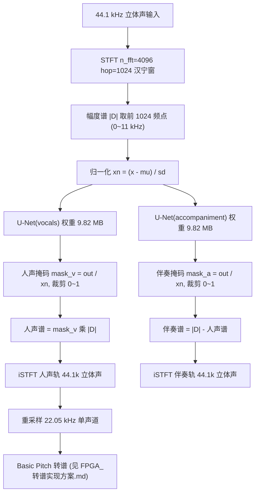

# 音轨分离（人声/伴奏）—— FPGA 实现方案（Spleeter U-Net）

> 平台：安路 PH1A180-MLK-H10-CK203/204（TangDynasty 工具链，无神经网络 IP，需手写 RTL）
> 算法：Spleeter 2stems 预训练权重（PyTorch 移植版，csukuangfj/spleeter-torch）
> 输入：44.1 kHz 立体声 ｜ 输出：人声轨 + 伴奏轨（44.1 kHz）
> PC 参考实现：`scripts/spleeter/run_spleeter.py` ｜ 备选方案（<100 ms）：`FPGA_分离实现方案_DSP备选.md`

---

## 0. 先看结论：能不能做？

**能做，但延迟不再是毫秒级。**

| 项目 | 数值 | 说明 |
|---|---|---|
| 模型参数 | 9.82 M / 轨，**19.6 M（双轨）** | 权重 INT8 ≈ 19.6 MB → **必须外挂 DDR** |
| 计算量（稠密） | 6.10 GMAC / 512 帧块 / 模型 | 见 §3.1 逐层表 |
| 计算量（优化后） | **1.54 GMAC / 块 / 模型** | stride=2 奇偶分解，算力降为 1/4 |
| 实时算力需求 | **≈0.34 GMAC/s**（双模型，含 25% 重叠） | 与 Basic Pitch 同量级，非常轻松 |
| DDR 带宽需求 | ≈9 MB/s（顺序读权重） | 任何 DDR 都够，**带宽不是瓶颈** |
| 片上缓存 | ≈1 MB（128 帧块） | 需确认 PH1A180 BSRAM 是否够；不够则激活也放 DDR |
| **延迟** | **≈1.5 ~ 3.0 s**（取决于分块） | 原 DSP 方案 <100 ms ⇒ **这是最大的代价** |
| 分离质量 | 人声 SI-SDR **12.98 dB** / 伴奏 8.74 dB | 对比：DSP 方案 5.53 / 0.20 dB |
| **INT8 后质量** | **人声 11.38 dB / 伴奏 7.59 dB**（128 帧） | 量化掉点仅 **−1.22 / −0.85 dB**，已实测 |

**一句话**：算力和带宽都不是问题，问题是**延迟**。Spleeter 是"整块推理"模型，片内至少要看 1.5~3 秒音频才出结果。若比赛指标硬性要求 <100 ms，请看 `FPGA_分离实现方案_DSP备选.md`。

---

## 1. 总体数据流



要点：

1. **两个独立模型**（vocals / accompaniment）各自跑一遍同样结构的 U-Net，输入相同（同一份归一化谱），输出各自掩码。
2. 模型只处理 **前 1024 个频点**（≤11.03 kHz）；11 kHz 以上不入模型，全部归伴奏。对下游转谱无影响（Basic Pitch 只用到 ≈7.8 kHz 以下）。
3. 伴奏 = 原谱 − 人声谱（**不是** mask_a × 原谱），保证两轨相加等于原信号。
4. 归一化统计量 `mu/sd` 是**全局**的（PC 版按整首歌算）。FPGA 上改为滑动统计或固定常数，见 §5.6。

---

## 2. 网络结构（单模型，逐层）

U-Net：**6 层下采样编码器 + 6 层上采样解码器 + 5 条跳跃连接 + 输出卷积**。

编码器每层规则：

```
输入 x -> F.pad(左1右2上1下2, 常数0) -> Conv2d(k=5, s=2, padding=0) -> BatchNorm2d -> LeakyReLU(0.2)
```

解码器每层规则：

```
输入 -> ConvTranspose2d(k=5, s=2) -> 裁掉 [1:-2] -> ReLU -> BatchNorm2d -> 与对应编码器输出 concat
```

特殊点（**实现时最容易错的地方**）：

| # | 说明 |
|---|---|
| 1 | 卷积本身 `padding=0`，pad 是**手动不对称**加的：`(1, 2, 1, 2)` = 左1右2上1下2 |
| 2 | 转置卷积输出后要**裁掉首 1、尾 2**（`[1:-2]`），否则与跳跃连接尺寸对不上（2n+3 → 2n） |
| 3 | 编码器前 5 层有 BN+LeakyReLU；**第 6 层（瓶颈，256→512）无 BN、无激活**，直接送解码器 + 做跳跃连接 |
| 4 | 解码器激活顺序是 **ReLU → BN**（先激活后归一化，与编码器相反） |
| 5 | 最后一层是 `Conv2d(1→2, k=4, dilation=2, padding=3)`，不是转置卷积；输出经 `sigmoid` 后**乘回网络输入**（`out = sigmoid(conv) * in_x`） |
| 6 | 模型输出是"掩码 × 归一化谱"，要用掩码必须**除以归一化谱**反解 |

### 2.1 实际张量尺寸（输入 512 帧块）

| 层 | 输入 (C,H,W) | 输出 (C,H,W) | 参数 | MAC（稠密） |
|---|---|---|---|---|
| conv (2→16) | (2, 515, 1027) | (16, 256, 512) | 816 | 104.9 M |
| conv1 (16→32) | (16, 259, 515) | (32, 128, 256) | 12,832 | 419.4 M |
| conv2 (32→64) | (32, 131, 259) | (64, 64, 128) | 51,264 | 419.4 M |
| conv3 (64→128) | (64, 67, 131) | (128, 32, 64) | 204,928 | 419.4 M |
| conv4 (128→256) | (128, 35, 67) | (256, 16, 32) | 819,456 | 419.4 M |
| conv5 (256→512) | (256, 19, 35) | (512, 8, 16) | 3,277,312 | 419.4 M |
| up1 (512→256) | (512, 8, 16) | (256, 19, 35) | 3,277,056 | 419.4 M |
| up2 (512→128) | (512, 16, 32) | (128, 35, 67) | 1,638,528 | 838.9 M |
| up3 (256→64) | (256, 32, 64) | (64, 67, 131) | 409,664 | 838.9 M |
| up4 (128→32) | (128, 64, 128) | (32, 131, 259) | 102,432 | 838.9 M |
| up5 (64→16) | (64, 128, 256) | (16, 259, 515) | 25,616 | 838.9 M |
| up6 (32→1) | (32, 256, 512) | (1, 515, 1027) | 801 | 104.9 M |
| up7 (1→2, k4,d2) | (1, 512, 1024) | (2, 512, 1024) | 34 | 16.8 M |
| **合计** | | | **9,820,739** | **6.10 G** |

> 注：`H` 是时间帧、`W` 是频点。尺寸含 pad；H/W 每层 ÷2（时间 512→8，频点 1024→16）。
> 含 BN 参数后总参数 9,822,725（ONNX 统计），两轨共 **19,645,450**。

---

## 3. 计算量、存储与带宽

### 3.1 算力：稠密 vs 奇偶分解

上表的 MAC 是**稠密**计数（每个输出像素都按完整的 5×5=25 个抽头算）。实际上 stride=2、k=5 的卷积可以做**奇偶分解（polyphase）**：

```
输出像素按 (行奇偶, 列奇偶) 分 4 类，每类只需 3x3 / 3x2 / 2x3 / 2x2 子核
平均抽头数 = (9+6+6+4)/4 = 6.25 = 25/4
```

于是真实 MAC 数 = 稠密计数 ÷ 4：

| 组成 | 稠密 | 奇偶分解 |
|---|---|---|
| 6 层编码器 conv | 2.20 G | 0.55 G |
| 6 层解码器 convT | 3.87 G | 0.97 G |
| 输出卷积 up7 | 0.02 G | 0.02 G |
| **单模型 / 512 帧块** | **6.10 G** | **1.54 G** |

**实时需求**（1 帧 = 1024/44100 = 23.2 ms）：

```
单模型： 1.54 G / 11.9 s = 0.129 GMAC/s
双模型： 0.258 GMAC/s
含 25% 重叠重算 (x1.33)： ≈ 0.34 GMAC/s
```

对比：Basic Pitch 转谱 ≈ 0.24 GMAC/s。**两者同量级，PH1A180 完全吃得下。**

按 128 帧块（2.97 s）算，单块双模型 = 0.77 GMAC；若卷积引擎做到 **8 MAC/时钟 @ 150 MHz（1.2 GMAC/s）**，一个块只需 **0.64 s** 算完，而实时预算有 2.2 s（25% 重叠），余量 3.4 倍。

> 建议引擎规模：**8 ~ 32 个 INT8 乘加 @ 100~150 MHz**（0.8~4.8 GMAC/s）。

### 3.2 权重存储（放 DDR）

| 层 | 权重 (INT8) | 策略 |
|---|---|---|
| conv ~ conv4（前 4 层编码器） | 0.8 B ~ 205 KB | 常驻片上 BSRAM |
| conv5 (128→256) | 819 KB | 流式，或分片常驻 |
| **conv6 (256→512)** | **3.28 MB** | **必须 DDR 流式** |
| **up1 (512→256)** | **3.28 MB** | **必须 DDR 流式** |
| **up2 (512→128)** | **1.64 MB** | **必须 DDR 流式** |
| up3 ~ up7 | 410 KB ~ 32 B | 常驻片上 |
| **单模型合计** | **9.82 MB** | 双模型 19.6 MB 全部放 DDR，按块顺序流一遍 |

**关键事实**：权重只需**每次分块读一遍**（顺序、无随机访问）。512 帧块时 = 9.82 MB / 11.9 s ≈ 0.83 MB/s/模型，双模型 + 重叠 ≈ **2.2 MB/s**；128 帧块 ≈ **8.8 MB/s**。对任何 DDR（哪怕 200 MB/s 的低端 DDR3）都是零头。

> 实现注意：3 个大层（conv6/up1/up2）的输出空间很小（128 帧块时只有 512×2×16、256×4×32、128×8×64），**按"整层一次处理"即可**，无需为省带宽做输出分块；权重顺序流入即可，配合乒乓 FIFO。

### 3.3 激活缓存（片上）

以 **128 帧块** 计算（时间 128→64→32→16→8→4→2，频点 1024→512→…→16）：

| 内容 | 数量（值） | INT8 大小 |
|---|---|---|
| 编码器各层输出（= 跳跃连接，需保留 5 层） | 131k + 65.5k + 32.8k + 16.4k + 8.2k = 254 k | 254 KB |
| 解码器 merge 张量（最大 262 k 值） | ≈ 508 k | 508 KB |
| 输入谱 (2 × 1024 × 128) | 262 k | 262 KB |
| **合计** | **≈ 1.02 M 值** | **≈ 1.0 MB** |

**结论：片上约需 1 MB 缓存**（若用 16-bit 存激活则 ~2 MB）。这决定了两条路：

- BSRAM 够（≥1.5 MB）→ 激活全片上，DDR 只出权重；
- BSRAM 不够 → 跳跃连接（254 KB）落 DDR，读写各一次 ≈ 0.5 MB/块 ⇒ 0.35 MB/s，仍可忽略。

> 也可用**时间 tiling + halo** 把缓存压到 256 KB 以内（见 §5.4）。

---

## 4. 延迟分析（本方案最大代价）

模型内部有 6 级时间下采样，最深一层只看到 2 帧；**分块越短，边界上下文越少，质量越低**。实测（RTX 5060，官方 512 帧为基准）：

| 分块 | 音频长度 | 理论延迟 | 人声保留 | 吉他泄漏 | 人声泄漏 | 人声 SI-SDR | 伴奏 SI-SDR |
|---|---|---|---|---|---|---|---|
| 512 帧（官方） | 11.9 s | 11.9 s | 0.976 | 0.099 | 0.042 | 12.98 dB | 8.74 dB |
| 256 帧 | 5.9 s | 5.9 s | 0.974 | 0.097 | 0.049 | 12.73 dB | 8.51 dB |
| **128 帧（推荐）** | **3.0 s** | **≈3.0 s** | **0.974** | **0.088** | **0.064** | **12.60 dB** | **8.44 dB** |
| 64 帧 | 1.5 s | 1.5 s | 0.965 | 0.074 | 0.103 | 11.35 dB | 7.34 dB |
| 128 帧 + INT8 | 3.0 s | 3.0 s | 0.966 | 0.052 | 0.119 | 11.38 dB | 7.59 dB |

（对比：DSP 纯算法方案 5.53 / 0.20 dB；Demucs 参考）

**推荐 128 帧**：质量只掉 0.38 dB，缓存降到 512 帧方案的 1/4，延迟 ≈3 s。
若必须再压延迟，64 帧也可接受（仍比 DSP 方案高一倍质量），代价 −1.6 dB。

**流水线延迟构成（128 帧块）**：

```
STFT 窗 4096 (93 ms) + 攒满 128 帧 (3.0 s) + 模型计算 (~0.3-0.6 s, 可与下一块重叠)
≈ 3.2 ~ 3.6 s，取输出起点算最低 ≈3.0 s
```

> 若要再降，只能减小分块或改用**因果流式改造**（改为因果卷积 / 用缓存状态代替整块），除非重训否则不建议。

---

## 5. FPGA 实现要点

### 5.1 卷积引擎：一个引擎覆盖 3 种算子

| 算子 | 出现位置 | 实现方式 |
|---|---|---|
| stride-2 前向卷积 (k=5) | 6 层编码器 | 按输出像素奇偶选 3×3/3×2/2×3/2×2 子核 |
| stride-2 转置卷积 (k=5) | 6 层解码器 | **① 零插值+普通卷积**（简单、浪费 4× 算力）；**② 子像素分解**（推荐、算力 1/4、无需插零缓冲） |
| 普通卷积 (k=4, d=2) | 输出层 up7 | 直接 4 抽头 × 2 抽头（膨胀等效 8×8 稀疏核） |

推荐**统一为"输出驱动"的 gather 结构**：

```
for each 输出像素 (H_out, W_out):
    取该像素所属相位的子核 (<= 3x3)
    for c_in in 0..C_in-1:      # 通道流水
        acc += w[c_in] * activ[c_in]
    acc += bias  ->  BN 系数 -> 激活 -> 写回
```

- 转置卷积的子核 = 原核按 stride 抽取（`w[phase_h::2, phase_w::2]`），**无需显式插零**；
- 裁剪 `[1:-2]` 直接体现为输出坐标偏移（少算 3 行 3 列），不产生额外数据搬运；
- 通道维流水 + 输出像素并行（例如同时算 4~16 个输出像素），让 8~32 个 MAC 单元一直忙。

### 5.2 定点化与算子融合（省算力的关键）

| 项 | 做法 | 收益 |
|---|---|---|
| 编码器 Conv+BN | BN 是推理期线性变换，**完全折叠进卷积权重与偏置** | 省 1 次乘加/通道 |
| 解码器 ConvT→ReLU→BN | ReLU 夹在中间不能折叠，但 BN 可化为 **逐通道 scale + shift**（1 乘 1 加） | 便宜 |
| LeakyReLU / ReLU | 分段线性：`y = x>=0 ? x : 0.2x`（0.2 ≈ 51/256，移位+加即可精确） | 零成本 |
| Sigmoid | 16 段线性插值 LUT（误差 <1e-4） | — |
| 掩码反解除法 `out / xn` | **LUT 求倒数**：`1/xn` 用 256 项表 + 线性插值；`abs(xn) < eps` 时输出 0 | 免除法器 |
| 权重 / 激活 | **INT8 per-channel 量化**，累加 INT32/INT16 | 权重流 0.43 GB/s @4.8 GMAC/s，仍远低于 DDR 上限 |

### 5.2.1 INT8 量化已实测（QDQ 静态量化）

用 onnxruntime 做 **QDQ 静态量化**（opset 13，权重 per-channel INT8、激活 UINT8，校准集 = 16 块真实音频谱），实测：

| 模型 | 文件大小 | 128 帧分块下的分离质量 |
|---|---|---|
| fp32 ONNX | 37.5 MB / 模型 | 人声 12.60 dB / 伴奏 8.44 dB（与 PyTorch 完全一致） |
| **INT8 QDQ** | **9.5 MB / 模型** | **人声 11.38 dB / 伴奏 7.59 dB** |
| 掉点 | ↓75% 存储 | **−1.22 dB / −0.85 dB**（可接受） |

结论：**INT8 量化后仍远优于 DSP 方案（5.53 / 0.20 dB）**，且 9.5 MB/模型与理论值
（9.82 M 参数 × 1 B）吻合，可直接作为 FPGA 权重预算。复现：
`python scripts/spleeter/quantize_spleeter_qdq.py --patch 128` 然后
`python scripts/spleeter/run_spleeter_onnx.py --quant qdq8 --patch 128`。

> 校准集只用了 16 块（1 首歌），上板前建议用多首歌、更多分块复核；
> 如需更好效果可改用逐层敏感度分析（敏感层保留 16-bit）。

### 5.3 跳跃连接与特征缓存

5 条跳跃连接（编码器第 1~5 层输出 concat 到解码器）：

- 用 5 块独立 BSRAM（尺寸递减：131k / 65.5k / 32.8k / 16.4k / 8.2k 值）；
- 写一次（编码器）、读一次（解码器），**无重写**，可按 FIFO/LIFO 管理；
- concat 是"宽通道"拼接：解码器读时把两块地址空间当作连续通道索引即可，**不需要物理拼接**（省一次搬运）。

### 5.4 时间 tiling + halo（可选，压缓存用）

若片内 RAM 紧张：把时间轴按 32 帧切片，每片带 **±64 帧 halo**（覆盖最深层 2^6=64 帧的感受野），单独过网络后只保留中心 32 帧。

- 缓存降到 ~256 KB；
- 代价：算力 ×(1 + 2×64/32) = **×5**（1.7 GMAC/s，仍可行）；
- 边界质量由 halo 保证，实测与整块推理差别很小（与 128 帧 vs 512 帧的 0.4 dB 同级）。

### 5.5 STFT / iSTFT 链路

| 参数 | 值 | 说明 |
|---|---|---|
| 采样率 | 44.1 kHz | 与输入一致，无需重采样 |
| n_fft | 4096 | 窗长 92.9 ms |
| hop | 1024 | 23.2 ms，帧率 43.07 Hz |
| 窗 | 汉宁 | 预计算 ROM 4096×16 bit |
| 频点数 | 2049（用前 1024） | 实 FFT 后取幅度 |

- FFT：4096 点流水 FFT（Radix-2/4），每 hop 每声道 1 次 ⇒ **86 次/秒**，可忽略不计；
- 幅度谱：`|D| = sqrt(re²+im²)`，用 CORDIC 或近似 `alpha*max + beta*min`；
- 频谱只保留前 1024 bin，后 1025 bin 直接旁路（伴奏全收）；
- iSTFT 用重叠相加（OLA），窗和归一化查表；
- **注意**：PC 版用 librosa `center=True`（首尾补窗），FPGA 流式实现按自然起点即可，差异只在首尾 93 ms。

### 5.6 归一化统计量（流式近似）

PC 版用**整首歌全局** `mu/sd`。FPGA 上三选一：

| 方案 | 做法 | 评价 |
|---|---|---|
| A. 固定常数 | 用训练集统计的固定 mu/sd | 最简单，跨歌曲泛化略降 |
| B. 滑动统计 | 用过去 N 秒（如 10 s）的均值/方差，块间一阶平滑 | **推荐**，接近全局效果 |
| C. 逐块统计 | 每块独立算 mu/sd | 块间波动造成音量起伏，不建议 |

### 5.7 DDR 访问模式建议

| 数据 | 访问 | 频率/带宽 |
|---|---|---|
| 权重 19.6 MB | 顺序读，**每次分块每模型读一遍** | ≈9 MB/s（128 帧块，双模型含重叠） |
| 跳跃连接（若落 DDR） | 顺序写 + 顺序读 | ≈0.7 MB/s |
| 输入/输出音频 | 环形缓冲 | ≈0.35 MB/s |
| （可选）整段音频缓存 | 顺序 | 77 s 立体声 fp32 = 27 MB |

建议 DDR 分区：`[权重 19.6 MB][音频环形缓冲][跳跃连接 scratch]`，权重区按层切好、地址预计算成常量表，**运行时不做地址运算**。

---

## 6. 资源估算与实施步骤

### 6.1 粗略资源（PH1A180 上，待上板核实）

| 资源 | 需求 | 说明 |
|---|---|---|
| INT8 MAC | 8~32 个 | 主要吃 LUT/DSP；INT8 可用 LUT 乘法或 18×18 DSP 拆 |
| 片上 RAM | ~1 MB | 激活 + 小层权重 + 窗口 + FIFO |
| DDR | 19.6 MB 权重 + 缓冲 | 必须外挂 |
| 时钟 | 100~150 MHz | 单时钟域即可 |
| 乘法器利用率 | 极低（<10%） | 需求 0.34 vs 供给 ≥0.8 GMAC/s |

### 6.2 实施里程碑

| 阶段 | 内容 | 验收 |
|---|---|---|
| M1 | PyTorch 参考实现 ✅ 已完成 | 与 Demucs 对拍 SI-SDR 12.98 dB |
| M2 | ONNX 导出 ✅ 已完成（时间轴动态，单模型 37.5 MB） | 最大误差 1.24e-5（512 帧）/ 2.35e-6（128 帧） |
| M3 | INT8 量化 + 音频回归 ✅ 已完成（QDQ，9.5 MB/模型） | 掉点 −1.22 dB，11.38 / 7.59 dB |
| M4 | 卷积引擎 RTL + 单层对拍 | conv1 / up1 逐像素误差 < LSB + 容差 |
| M5 | 整网 bit-true 对拍（小尺寸输入） | 与 ONNX 逐像素误差 < 1% |
| M6 | DDR 权重调度 + 128 帧块全流程 | 一块耗时 < 2.2 s（实时裕量 25%+） |
| M7 | STFT/iSTFT 链路 + 音频回环 | 与 PC 版波形对拍，SI-SDR > 11 dB |
| M8 | 接转谱模块上板联调 | 输出 MIDI 与 PC 管线一致 |

---

## 7. 参数速查表

```
采样率            44100 Hz（立体声）
STFT              n_fft=4096  hop=1024  汉宁窗  取前 1024 频点
分块              128 帧（2.97 s），重叠 25%，步进 96 帧      <- 推荐
单模型参数        9,822,725（ONNX 统计）    两模型 19,645,450
权重 INT8         9.82 MB / 模型            19.6 MB 总计 -> DDR
单块 MAC（稠密）  6.10 G / 模型
单块 MAC（优化）  1.54 G / 模型   (stride 奇偶分解, 1/4)
实时算力          0.34 GMAC/s（双模型 + 25% 重叠）
DDR 权重带宽      ≈9 MB/s（128 帧块）
片上激活缓存      ≈1 MB（128 帧块）
INT8 量化         9.5 MB / 模型（QDQ，权重 per-channel INT8、激活 UINT8）
INT8 掉点         人声 −1.22 dB / 伴奏 −0.85 dB（128 帧：12.60→11.38 / 8.44→7.59）
延迟              ≈3.0 s（128 帧块） / 1.5 s（64 帧块） / 11.9 s（512 帧块）
输出              vocals / accompaniment 两轨 44.1k 立体声
下游              重采样 22.05 kHz 单声道 -> Basic Pitch
```

### 网络通道数速查

```
编码器:  2 -> 16 -> 32 -> 64 -> 128 -> 256 -> 512   (6 层, k=5 s=2, pad 手动 (1,2,1,2))
解码器:  512 -> 256 -> 128 -> 64 -> 32 -> 16 -> 1   (6 层, convT k=5 s=2, 输出裁 [1:-2])
输出层:  1 -> 2, k=4, dilation=2, padding=3, sigmoid, 再乘回输入
激活:    LeakyReLU(0.2) x5（编码器） / ReLU x6（解码器） / 无激活（瓶颈 conv6）
归一化:  BN(eps=1e-3) —— 编码器在激活前，解码器在激活后；瓶颈层无 BN
跳跃连接: enc1..enc5 -> dec1..dec5 (concat, 通道维)
```

---

## 8. 与替代方案对比

| 方案 | 质量（人声/伴奏 SI-SDR） | 延迟 | 参数 | 算力 | FPGA 结论 |
|---|---|---|---|---|---|
| **Spleeter U-Net（本方案）** | **12.98 / 8.74 dB**（INT8 11.38 / 7.59） | ≈3 s | 19.6 M | 0.34 GMAC/s | DDR 装权重，算力轻松，**延迟是唯一短板** |
| DSP 谐波掩码（备选） | 5.53 / 0.20 dB | <100 ms | 0 | ~0.01 GMAC/s | 零模型零延迟，质量一般 |
| Demucs（仅 PC 用） | 参考基准 | — | ~41 M | ~7 GMAC/s | 算力/结构不适合手写 RTL |

---

## 9. 已知限制与风险

| # | 风险 | 影响 | 缓解 |
|---|---|---|---|
| 1 | **延迟 ≈3 s** | 若比赛指标 <100 ms 则不合格 | 换 DSP 备选方案；或与评委确认指标口径 |
| 2 | 权重 19.6 MB 必须 DDR | 板子无 DDR 则不可行 | 只能退 DSP 方案 |
| 3 | 11 kHz 以上不入模型 | 人声齿音缺失、高频全归伴奏 | 对转谱无影响（Basic Pitch ≤7.8 kHz）；听感上人声略闷 |
| 4 | 全局归一化 → 流式近似 | 用滑动统计需实测对比 | M3 阶段用真实音频回归验证 |
| 5 | ~~INT8 掉点未知~~ → **已实测 −1.22 dB** | 可接受，量化后仍 2 倍优于 DSP | 校准集扩大后可复核；敏感层可保留 16-bit |
| 6 | 3 个大层权重 > BSRAM | 需 DDR 流式调度逻辑 | 顺序读 + 乒乓 FIFO，地址常量表 |
| 7 | 分块边界伪影 | 25% 重叠 + 交叉淡化 | 实测 128 帧仅 −0.38 dB |

---

## 附：PC 端复现命令

```powershell
# 1) 下载权重（国内用 hf-mirror）-> scripts/spleeter/vocals.pt, accompaniment.pt
python scripts/spleeter/download_weights.py --onnx

# 2) 分离（默认 512 帧；--patch 128 为 FPGA 推荐配置）
python scripts/spleeter/run_spleeter.py --audio "吉他+人声.mp3" --patch 128

# 3) INT8 静态量化（QDQ，9.5 MB/模型）+ 量化后分离回归
python scripts/spleeter/quantize_spleeter_qdq.py --patch 128
python scripts/spleeter/run_spleeter_onnx.py --audio "吉他+人声.mp3" --quant qdq8 --patch 128

# 4) 逐层参数/MAC 表（本文件 §2.1 / §3.1 数据来源）
python scripts/spleeter/layer_stats.py

# 5) 不同分块大小的质量对比（本文件 §4 数据来源）
python scripts/spleeter/eval_patch.py --ref-dir ../../output
```
