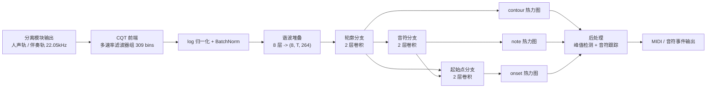

# Basic Pitch 转谱 —— FPGA 实现方案

> 目标平台：安路 PH1A180-MLK-H10-CK203/204（TangDynasty 工具链）
> 约束：**全程 FPGA、流式实时、INT8 量化、无 PC 参与**
> 模型：Basic Pitch（16,782 参数），输入 2 秒音频窗口，输出 3 张热力图
> 已验证：PyTorch 复现与原版 TensorFlow 输出一致（误差 < 3e-4）；ONNX 导出数值误差 < 1e-5

## 1. 总体数据流



**两条音轨各跑一次转谱**（人声 → 人声谱，伴奏 → 吉他谱），可用同一套推理引擎分时复用。

## 2. 计算负载分析（决定资源分配的重点）

| 模块 | 计算量（每 2 秒窗口） | 实时折算 | 结论 |
|------|---------------------|---------|------|
| CQT 前端 | 约 100M~1G MAC（取决于实现方式） | 50M~500M MAC/s | **最大头，重点优化对象** |
| 卷积主干 | **约 484M MAC** | 242M MAC/s | 小，DSP 资源充足即可 |
| 归一化/BN/堆叠 | 约 309×172 次运算 | 可忽略 | 流水线处理 |

结论：**CNN 部分很轻**（参数 1.7 万、每窗口 4.8 亿次乘加），真正的难点在 **CQT 前端**和**后处理**。

## 3. 模块 1：CQT 前端（核心难点）

### 规格

| 参数 | 值 |
|------|-----|
| 采样率 | 22050 Hz |
| 频率范围 | 27.5 Hz 起（A0），88 个半音 × 3 bins/半音 = **309 bins** |
| bins/octave | 36（即 3 bins/半音） |
| hop | 256 采样（≈11.6ms） |
| FFT 窗长 | 2048 采样 |
| 输出帧数 | 172 帧 / 2 秒窗口 |

### 推荐实现：多速率滤波器组（与 nnAudio 一致）

CQT 的 Q 值固定（Q ≈ 51），低频 bin 的时域核极长（27.5Hz 处约 4 万点），**不能直接逐 bin 卷积**。
标准做法是"顶八度滤波器组 + 逐级 2 倍下采样复用"：

```
输入 22.05kHz
 ├─ 第1级：与 36 个复数核（约 644 点）卷积 -> 高频八度 bins
 ├─ 2 倍下采样
 ├─ 第2级：复用同一组核 -> 次高八度 bins
 ├─ 2 倍下采样
 ├─ ... 共 9 级 ...
 └─ 第9级：低频八度 bins
```

**实现要点**：
1. **频域卷积**：每级的卷积用 FFT 实现（`FFT → 与预存核频谱相乘 → IFFT`），比时域直接卷积省 10 倍以上；
2. **复用**：只需 **1 组 36 个复数核的频谱 ROM**（36×1024 复数 ≈ 288KB 16bit，可用外扩或大 BRAM）；
3. **分时复用**：9 级结构相同，可用 **1 个 FFT 核 + 1 个复数乘法器** 分时完成（帧率仅 86 帧/秒，时间极宽裕）；
4. **简化选项**：若资源紧张，可只做"顶八度 + 下采样复用"的 6~7 级近似（高频人声/吉他能量少，误差影响小），需实测验证。

### 输出

`309 bins × 172 帧` 的对数幅度谱，送归一化模块。

## 4. 模块 2：归一化 + BatchNorm + 谐波堆叠

| 步骤 | 运算 | 实现建议 |
|------|------|---------|
| 幅度平方 | 实部²+虚部² | 乘法器 ×2 |
| log | `10·log10(x+1e-10)` | **逐帧 min/max 归一化后再取 log**，可用 LUT + 移位实现（16bit 输入 → 8bit 输出 LUT，约 64KB ROM） |
| 逐帧归一化 | `(x - min) / (max - min)` | 需缓存整帧 309 个值（1 帧缓冲，约 618B） |
| BatchNorm | `y = a·x + b` | **离线折叠成乘加**（a、b 提前算好，运行时 1 次乘加） |
| 谐波堆叠 | 8 个谐波按频率轴平移后堆叠 | **纯地址偏移，零计算量**：shifts = [-36, 0, 36, 57, 72, 84, 93, 101] |

## 5. 模块 3：卷积主干（逐层参数表）

以下为 ONNX 导出的精确结构（可直接照此设计 RTL），输入为谐波堆叠后的 `(8, T, 264)`：

| 层 | 类型 | 核 / 步长 | 输入→输出通道 | 参数量 | MAC / 2秒窗口 |
|----|------|----------|--------------|--------|--------|
| conv_contour.0 | Conv2d + BN + ReLU | (3,39) / 1 | 8 → 8 | 7,512 | 340.0 M |
| conv_contour.3 | Conv2d + Sigmoid | 5 / 1 | 8 → 1 | 201 | 9.1 M |
| conv_note.0 | Conv2d + ReLU | 7 / (1,3) | 1 → 32 | 1,600 | 23.7 M |
| conv_note.2 | Conv2d + Sigmoid | (7,3) / 1 | 32 → 1 | 673 | 10.2 M |
| conv_onset_pre.0 | Conv2d + BN + ReLU | 5 / (1,3) | 8 → 32 | 6,496 | 96.7 M |
| conv_onset_post.0 | Conv2d + Sigmoid | 3 / 1 | 33 → 1 | 298 | 4.5 M |
| **合计** | | | | **16,782** | **484.2 M** |

**实现要点**：
1. **流式行缓冲**：时间维逐帧推进，卷积的"时间方向"核（3/5/7）只需缓存 2~6 帧历史；
   频率维（264）整行处理。**单层缓冲只需几 KB BRAM**，不需要存整个 (8,172,264) 特征图。
2. **BN 折叠**：`BatchNorm` 全部离线折进前一层卷积的权重/偏置（标准做法，零运行时开销）。
3. **Sigmoid**：LUT 实现（16bit 输入 → 8bit 输出，约 128KB ROM），或分段线性近似。
4. **定点格式**：建议 特征图 16bit、权重 8bit（INT8）、累加 24bit。
5. **两个 padding 操作**：`F.pad(...,(2,2,3,3))` 和 `(1,1,2,2)` 是**边界补零**，RTL 中用地址控制即可。

## 6. 模块 4：后处理（转 MIDI）

原版后处理包含：峰值检测、音符跟踪、最小长度过滤、pitch bend 估计——是**算法密集型**逻辑，
不适合纯 RTL 硬布线。

**建议方案（二选一）**：
1. **软核 CPU**（推荐）：安路 FPGA 内置或自行例化 RISC-V 软核，将后处理用 C 实现
   （可从 `note_creation.py` 逐函数移植），与硬件推理核通过 BRAM 交换数据；
2. **简化状态机**：只做"阈值 + 时间峰值 + 音符起止跟踪"的最小实现（牺牲 pitch bend），
   完全用 RTL 实现，资源省但功能受限。

**建议接口**：推理核输出 3 张热力图（DMA 写入 BRAM）→ 软核读取 → 峰值/跟踪 → 
串口 or SD 卡输出 MIDI 文件。

## 7. 量化与实时性方案

### INT8 量化路径
1. 已导出 ONNX 算子图（`onnx_export/basic_pitch_heads.onnx`），可用量化工具做 INT8 标定；
2. BN 折叠 → 逐层 scale/zero-point → 特征图 16bit / 权重 8bit；
3. **精度验证**：量化后转写结果与原模型对比（用 `pytorch_demo.py` / `transcribe.py` 生成参考 MIDI 对比音符数）。

### 实时性设计

| 项 | 方案 |
|----|------|
| 模型窗口 | 训练用 2 秒窗口，但**全卷积结构对时间长度不敏感**，可切成更短块 |
| 推荐块长 | **0.5 秒块 + 0.25 秒重叠** → 转谱延迟约 0.5s |
| 或保守方案 | 2 秒滑动窗口（延迟 2s，与训练完全一致，精度最稳） |
| 吞吐要求 | 两路音轨 × 242M MAC/s ≈ **484M MAC/s**；分时复用一套引擎即可满足 |

### 与分离模块串联的总延迟

```
分离（<100ms，DSP 谐波掩码）→ 缓冲 0.5s → 转谱（0.5s 块）→ 输出
总计约 0.6 ~ 1.1 秒（取决于块长选择）
```

## 8. 资源估算汇总

| 模块 | DSP | BRAM/ROM | 说明 |
|------|-----|---------|------|
| CQT 前端 | 中（1 个 FFT 核 + 1 个复数乘法器） | 核频谱 ROM ≈ 288KB | 分时复用 9 级 |
| 归一化/BN | 少 | LUT ≈ 64KB + 1 帧缓冲 | |
| 卷积主干 | 中（取决于并行度，建议 8~16 路乘加） | 行缓冲 几 KB | 484M MAC/窗口 |
| Sigmoid | 0（LUT） | ROM ≈ 128KB | |
| 后处理 | 0（软核） | BRAM 几百 KB | 软核 CPU |

**总量级**：DSP 与 BRAM 占用在 PH1A180 可承受范围内，瓶颈主要在 CQT 的时序设计与 ROM 容量。

## 9. 验证与参考文件（已交付）

| 文件 | 内容 |
|------|------|
| `onnx_export/basic_pitch_heads.onnx` | **卷积主干算子图**（推荐用这个，70.8KB），输入 `(1,8,T,264)` |
| `onnx_export/basic_pitch_full.onnx` | 完整模型（含 CQT，供对照，CQT 建议 RTL 实现） |
| `finetune/export_onnx.py` | 导出脚本 + 逐层参数打印 + ONNX 数值验证 |
| `basic_pitch_torch/model.py` | PyTorch 参考实现（逐层与 ONNX 对应） |
| `basic_pitch_torch/note_creation.py` | 后处理算法（软核 C 代码的移植来源） |
| `release/scripts/transcribe.py` | PC 端参考结果生成（用于对比验证） |

**验证方法**：把同一段音频分别送 PC 模型和 FPGA，比较输出的三张热力图（逐元素误差）与
最终 MIDI 音符事件（数量、音高、时间）。

## 10. 实施优先级建议

1. **先做卷积主干**（最容易，ONNX 已给，MAC 量小）→ 用随机输入对比 ONNX 输出验证；
2. **再做 CQT 前端**（最难，占资源大头）→ 单独验证 309 bins 输出与 Python 版本的一致性；
3. **然后串联 + 后处理**（软核）→ 端到端跑通；
4. **最后做量化与实时性优化**（块长选择、并行度调整）。

## 11. 为什么能塞进 FPGA / 限制在哪

### 能塞进去的原因

1. **参数量极小**：16,782 个参数（vs Demucs 的 41M），INT8 后权重仅约 17KB；
2. **计算量可控**：484M MAC / 2 秒窗口 ≈ 242M MAC/s，属中等规模，DSP 资源够用；
3. **结构流式**：全卷积、无注意力、无循环结构，时间维可用行缓冲流水处理；
4. **算子规整**：只有 Conv2d / BatchNorm / ReLU / Sigmoid / 逐帧归一化，全部可用 LUT+乘加实现。

### 限制（红线）

| 限制 | 影响 | 应对 |
|------|------|------|
| **CQT 是资源大头** | 顶八度 36 个复数核频谱 ROM ≈ 288KB，可能超片内 BRAM | 外扩存储；或减级近似（需实测精度） |
| **INT8 量化误差** | 音符判定阈值可能偏移 → 轻微漏音/增音 | 量化后必须用真实音频重新标定阈值并对比音符数 |
| **转谱延迟 0.5s 起** | 若用 0.5s 块，总延迟约 0.6~1.1s；不是"无延迟" | 需要更低延迟就用更短块 + 重叠，但边界效应会增大 |
| **块长与训练不一致** | 模型训练用 2 秒窗口，短块有边界效应 | 必须做重叠（建议 50%）并验证精度损失 |
| **后处理需软核** | 纯 RTL 实现峰值检测/音符跟踪不现实 | 用 RISC-V 软核跑 C；或接受简化版（无 pitch bend） |
| **双路吞吐翻倍** | 人声/伴奏两路都要转谱 | 分时复用一套引擎（时间余量充足） |
| **音域受限** | 只覆盖钢琴 88 键（MIDI 21~108） | 超范围音高（低音贝斯、打击乐）不输出，属模型本身特性 |
